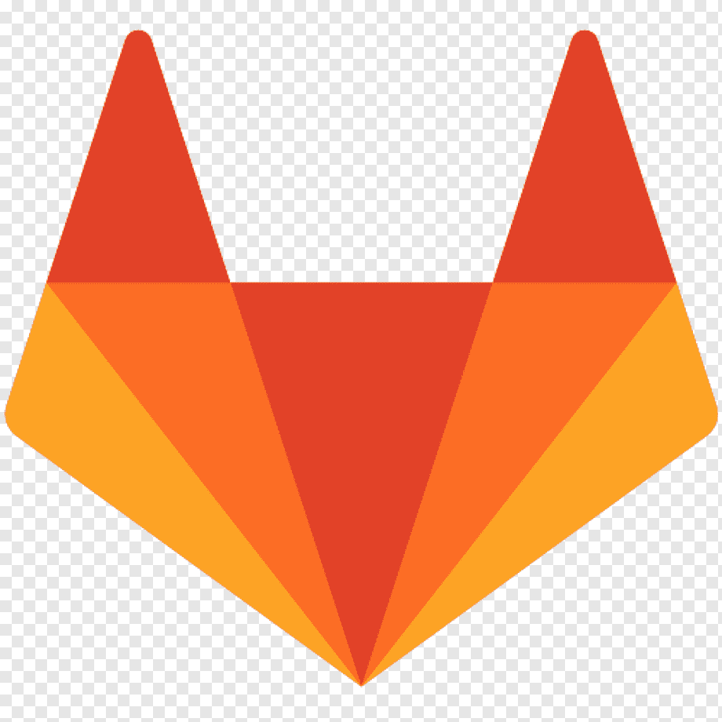

# Hello World 👋

- Contribuindo no [pyne2023](https://github.com/pythonNordeste/pyne2023 "Website Python Nordeste 2023").
- Fullstack developer em um projeto em fase de MVP.

**Contact:**
<section>
  
  
  
</section>
